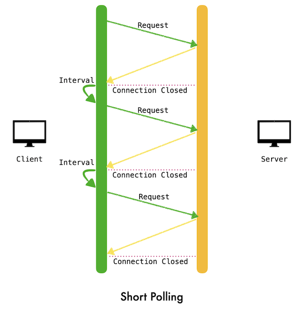
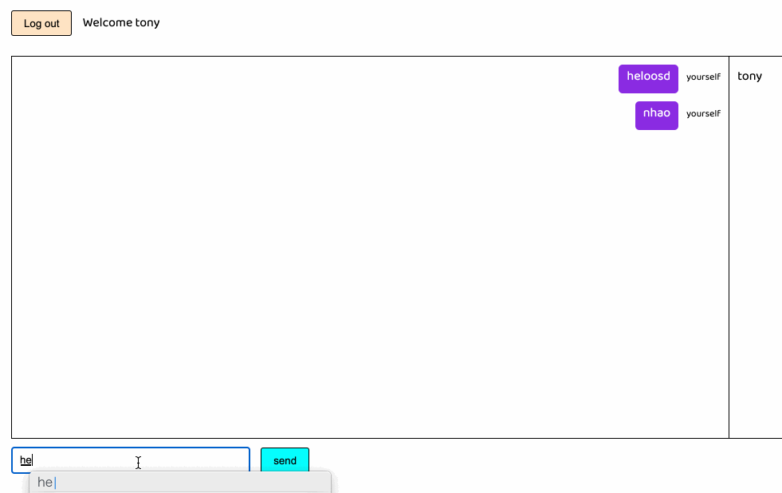
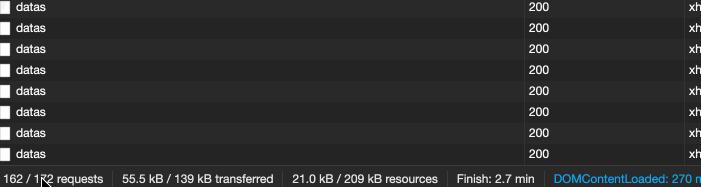
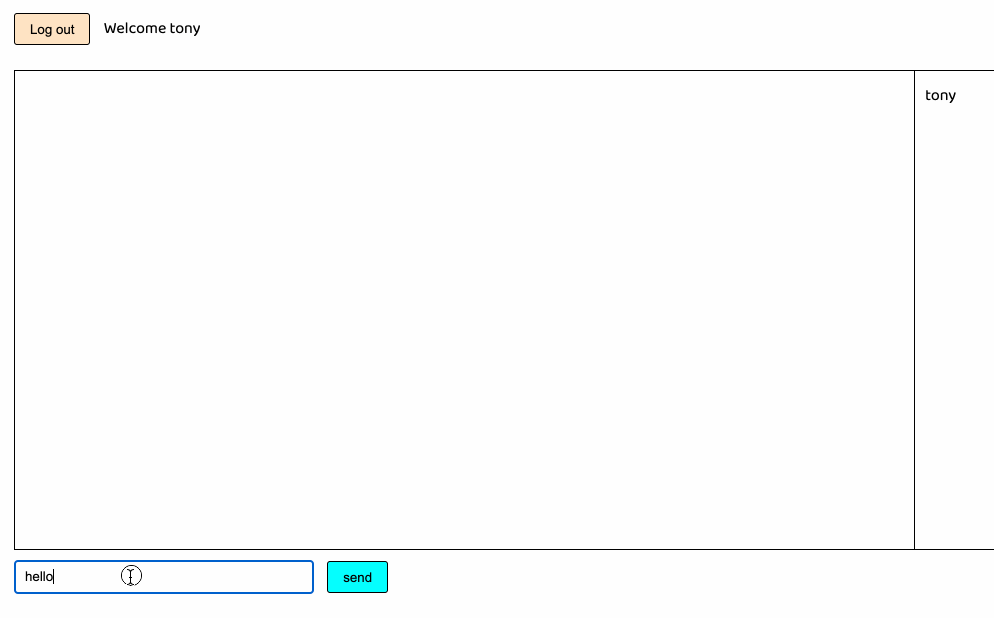

所谓的“实时推送”，从表面意思上来看是，客户端订阅的内容在发生改变时，服务器能够实时地通知客户端，进而客户端进行相应地反应。客户端不需要主观地发送请求去获取自己关心的内容，而是由服务器端进行“推送”。

注意上面的推送二字打了引号，这就意味着在现有的几种实现方式中，并不是服务器端主动地推送，而是通过一定的手段营造了一种实时的假象。就目前现有的几种技术而言，个人观点可以主要分为以下几类：

- 客户端轮询：传统意义上的轮询(Short Polling)
- 客户端 + 服务器端轮询：长轮询(Long Polling/COMET)
- 全双工通信：Websocket
- 服务器端轮询：Server-Sent Events(SSE)

从上面可以看出，真正是由服务器端进行消息推动的也就是Websocket以及SSE，至于轮询和长轮询就是营造出的假象。

文中会以一个简易聊天室的例子来分别通过上述的四种方式实现，代码地址[mini-chatroom](https://github.com/Rynxiao/mini-chatroom)


## 轮询（Short Polling）

轮询的实现原理：客户端向服务器端发送一个请求，服务器返回数据，然后客户端根据服务器端返回的数据进行处理；然后客户端继续向服务器端发送请求，继续重复以上的步骤，如果不想给服务器端太大的压力，一般情况下会设置一个请求的时间间隔。



使用轮询明显的优点是基础不需要额外的开发成本，请求数据，解析数据，作出响应，仅此而已，然后不断重复。缺点也显而易见：

- 不断的发送和关闭请求，对服务器的压力会比较大，因为本身开启Http连接就是一件比较耗资源的事情
- 轮询的时间间隔不好控制。如果要求的实时性比较高，显然使用短轮询会有明显的短板，如果设置interval的间隔过长，会导致消息延迟，而如果太短，会对服务器产生压力

代码实现：
```javascript
  var ShortPollingNotification = {
    datasInterval: null,
    subscribe: function() {
      this.datasInterval = setInterval(function() {
        Request.getDatas().then(function(res) {
          window.ChatroomDOM.renderData(res);
        })
      }, TIMEOUT);
      return this.unsubscribe;
    },
    unsubscribe: function() {
      this.datasInterval && clearInterval(this.datasInterval);
    }
  }
```



下面是对应的请求，注意左下角的请求数量一直在变化



在上图中，每隔1s就会发送一个请求，看起来效果还不错，但是如果将timeout的值设置成5s，效果将大打折扣，如图：




